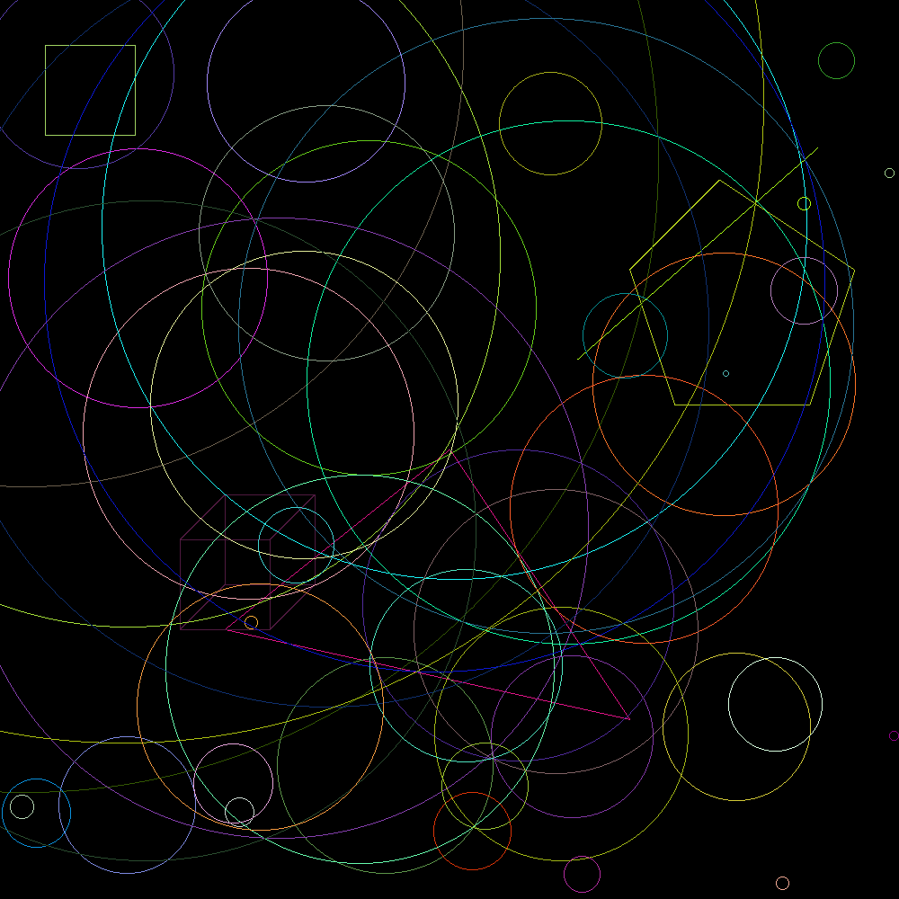

*# Geometrical Shapes Drawing


This Rust project demonstrates how to draw various geometrical shapes using the `raster` crate. The shapes include points, lines, triangles, rectangles, circles, pentagons, and cubes.

## Features

- **Point**: Represents a single point on the image canvas.
- **Line**: Draws a line between two points using Bresenham's line algorithm.
- **Triangle**: Draws a triangle using three points.
- **Rectangle**: Draws a rectangle given two opposite corners.
- **Circle**: Draws a circle centered at a point with a specified radius.
- **Pentagon**: Draws a regular pentagon centered at a point with a specified radius.
- **Cube**: Draws a 2D representation of a cube.

## Usage

1. Clone the repository:

   ```bash
   git clone https://zone01normandie.org/git/yasnaanani/drawing
   cd geometrical_shapes
   ```

2. Ensure you have Rust and Cargo installed.

3. Build and run the project:

   ```bash
   cargo build --release
   cargo run
   ```

4. The program will generate an `image.png` file in the current directory, showcasing the drawn shapes.



## Dependencies

- `raster`: A 2D graphics library for Rust used to handle images and pixel manipulation.
- `rand`: Provides random number generation capabilities.


## Author

- GitHub: [k11e3r](https://github.com/k11e3r)
- Email: prs.online.00@gmail.com

## Contributing

Contributions are welcome! If you find any bugs or want to add more shapes or features, feel free to open an issue or submit a pull request.


## License

This project is licensed under the MIT License. See the  [MIT License](LICENSE) file for details.
